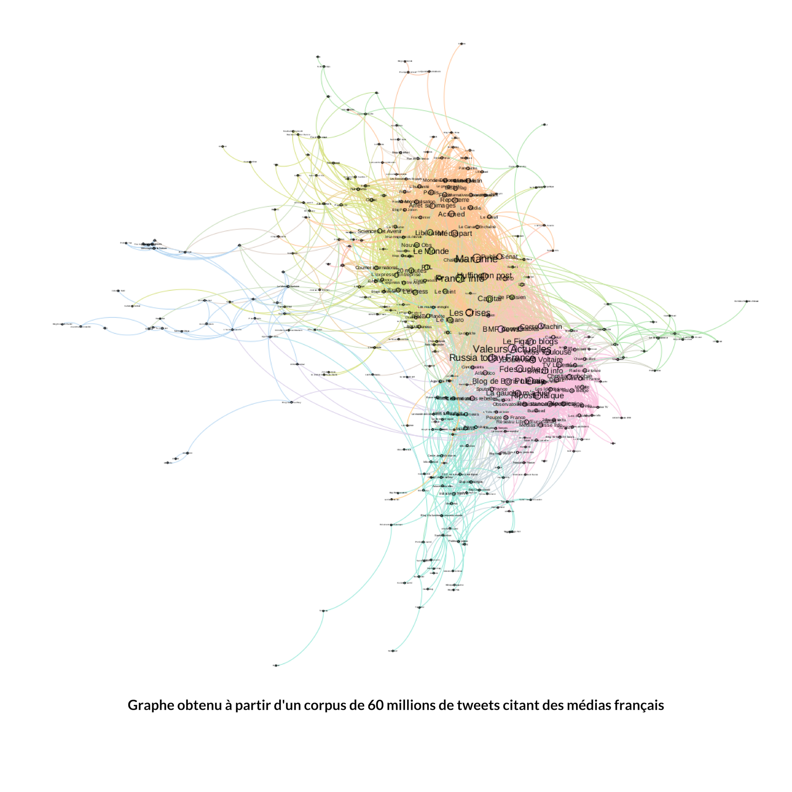
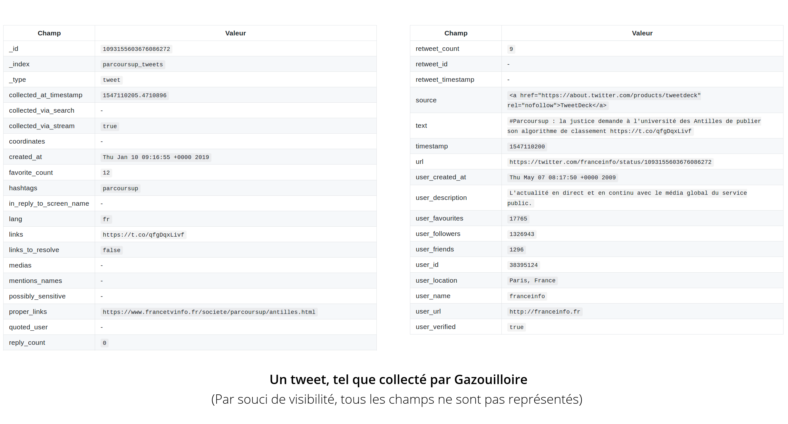
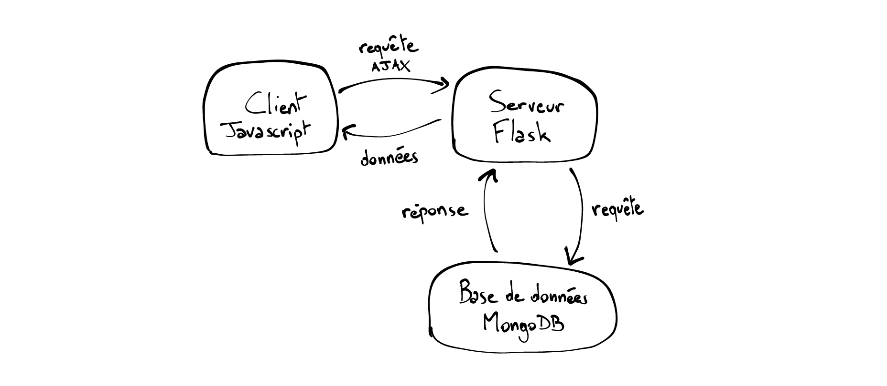

# [Notes]

- réflexion sur la mission et la manière dont vous vous êtes organisés
- réflexion sur les choix qui ont été faits
- réflexion sur la portée de vos réalisations, leurs avantages et inconvénients, leur devenir dans l'entreprise
- philosophie de l'open-source (contributions dans les 2 sens)

Résumé : web-mining, open source

# Remerciements

Je tiens à remercier Guillaume Plique et Benjamin Ooghe-Tabanou pour leur très grande disponibilité tout au long du stage et pour tout ce que j'ai appris grâce à eux, ainsi que toute l'équipe du laboratoire auprès de qui effectuer ce stage fut un plaisir.

# Sommaire

[TOC]

# Résumé technique

Mon stage a principalement consisté en l'amélioration d'outils et de librairies destinées à répondre aux besoins de chercheurs traitant de grandes masses de données issues du web. Les développements ont été principalement réalisés en Python, 

# Introduction

# 1. Un Médialab à SciencesPo ?

## Un laboratoire un peu particulier

Le Médialab est un des 10 centres de recherche de SciencesPo. Laboratoire numérique, le Médialab a été fondé en 2009 par le sociologue et philosophe [Bruno Latour](https://fr.wikipedia.org/wiki/Bruno_Latour) pour aider les sciences sociales et humaines à tirer le meilleur profit de la masse de données rendues disponibles par la numérisation. Ces données numériques sont au coeur des projets de recherche du labo : comment on perçoit/utilise les données numériques dans la société, ce qu'on en fait, quels outils on peut créer pour les collecter, les étudier, les exploiter, les visualiser, et ce, dans divers domaines (socio, histoire, art, ingénierie, design, pédagogie).
Il en ressort des productions de types très variés et peu courants pour un laboratoire de sciences sociales : aux traditionnels "papiers" (articles, livres, working paper, OpEd...) s'ajoutent des applis, des outils de collecte, d'exploration, de visualisation des données...

Constituée d'une trentaine de personnes, son équipe se distingue de celles des autres laboratoires de SciencesPo par sa grande diversité : chercheurs en sciences sociales, designers, ingénieurs pédagogiques et développeurs s'y côtoient.

Parmi les projets du laboratoire, on peut citer [La Fabrique de la Loi](https://www.lafabriquedelaloi.fr) qui propose une visualisation graphique  et détaillée des procédures parlementaires, le projet [Datapol](https://medialab.github.io/datapol/app/#!/) qui analyse les données numériques de la campagne présidentielle de 2017, ou [Dime Web](https://dime-shs.sciencespo.fr/instruments/dime-web/), qui vise à établir un ensemble d'outils open source permettant de collecter des données sur le web et sur les réseaux sociaux (Twitter notamment).

*Laboratoires similaires ?*

On peut citer comme laboratoires similaires le [Digital Methods Initiative](https://wiki.digitalmethods.net/) d'Amsterdam , l'[Oxford Internet Institute](https://www.oii.ox.ac.uk/), le [TANT-Lab](https://www.tantlab.aau.dk/) danois, ainsi que le [MIT Center for Civic Media](https://civic.mit.edu/) et le [Berkman Klein Center for Internet & Society](https://cyber.harvard.edu/), qui travaillent notamment sur la suite d'outils [Media Cloud](https://mediacloud.org/) répondant aux mêmes types de problématiques abordées par le Médialab. Ces deux laboratoires américains diffèrent cependant du Médialab sur certains points, notamment l'effectif - le Berkman Klein Center compte plus de 200 personnes - et les financements - le médialab du MIT est financé entièrement par des sponsors.

## L'équipe

Paul, Guillaume, Benjamin, Jean-Philippe, Robin, Donato, Damien, Audrey, Diego

L'équipe technique du laboratoire se compose d'un directeur technique (Paul Girard), d'ingénieurs de recherche, de designers et de développeurs. L'organisation est très horizontale, et aucune hiérarchie ne transparaît au quotidien, les décisions étant prises en collectif, lors des réunions hebdomadaires et des conseils de laboratoires.

J'ai principalement travaillé avec deux ingénieurs de recherche : mon tuteur Guillaume Plique et Benjamin Ooghe-Tabanou, présents quotidiennement dans le même bureau que le mien.

*Donneurs d'ordre ? Comment l'info circule-t-elle ?*

Les objectifs de long terme sont déterminés en commun avec mon tuteur, tandis que les tâches annexes et ponctuelles, comme le traitement d'un corpus spécifique, sont principalement définies par mail ou de vive-voix.

*Technologies maîtrisées par l'équipe ?*

La très grande majorité des outils développés par le laboratoire le sont en Python ou en Javascript. Des frameworks comme React sont utilisés, ainsi que des outils de déploiement et d'intégration comme Gitlab CI, Docker, Rancher. Tous les outils développés le sont en open-source, et sont publiés sur le [repo du laboratoire](https://github.com/medialab) le plus souvent sous licence AGPL-3.0, GPL-3.0 ou MIT.

*Méthodes et outils utilisés (agile, git) ? Validation des développements (tests) ?*

L'équipe s'organise d'une part via une réunion hebdomadaire de tous les membres du laboratoire, où l'on partage les avancées et projets de chacun et où ont lieux des réflexions plus larges et globales sur le laboratoire, et d'autre part via la réunion technique, bimensuelle. C'est pendant cette réunion technique que sont gérés les projets en cours et à suivre, via une méthode agile.

# Ma mission

## Le sujet

*Sujet initial*

Dans le cadre d'un projet de recherche de [Dominique Cardon](https://fr.wikipedia.org/wiki/Dominique_Cardon_(sociologue)) étudiant la polarisation de l'espace médiatique numérique français, le stage porte sur les techniques de récolte de données web (sites, réseaux sociaux) et de visualisation de celles-ci. 

La *polarisation de l'espace médiatique* ? Pour saisir les intentions de ce projet de recherche, il faut partir d'une étude du [Berkman Klein Center for Internet & Society]((https://cyber.harvard.edu/)) sur la campagne présidentielle américaine de 2016. En étudiant la façon dont les médias s'intercitent et la façon dont ils sont partagés en ligne, le laboratoire a conclu à une très forte polarisation, où d'un côté la gauche et le centre se rapprochent quand de l'autre la droite s'éloigne un peu plus vers la droite.  Il s'agit en quelque sorte de vérifier de façon empirique, sur de grandes quantitées de données, des hypothèses sociologiques.

Le but de ce projet de recherche du Médialab, qu'on appellera le projet *Polarisation* dans la suite, est de répliquer cette analyse sur l'espace médiatique français. Comment une polémique d'actualité comme l'affaire Benalla se diffuse au travers des différents médias ? Les mêmes thèmes sont-ils abordés partout ? 

Concrètement, cette polarisation s'étudie via la construction de réseaux : on peut par exemple établir un graphe de médias à partir des partages de liens sur les réseaux sociaux. Ainsi, deux médias seront liés si le même profil de personnes les partagent. Un tel graphe permet ensuite d'identifier des groupes, ou pôles, dans l'espace médiatique.

*Graphe produit à partir d'un corpus de 60 millions de tweets contenant des liens vers des médias français*

[ Répliquer une étude du Berkman Center : intercitation des médias, comment les gens partagent ces médias, informations révélées apr le réseau, vérifier des hyptohèses sociologiques, Benalla : comment les thèmes d'un sujet se diffusent au travers des différents médias, légitimité des médias ?, 

Hypothèse de l'institut Montaigne : aux US grosse polarisation des médias (gauche/droite assez hermétiques), qui s'accentue (Berkman). Hypothèse du directeur de Berkman : la droite s'éloigne (jeu dégueulasse) et le centre

Même chose en France : globalement oui, mais bien moins dramatique. Médias alternatifs très peu considérés 

Polarisation : réseaux de co-occurence de tweets (réseau bipartite : 2 types de noeuds : un utilisateur partage un média n fois) réseau de similarité de média par le truchement des utilisateurs

Chaque média est un vecteur de ses utilisateurs -> similarité cosinus

Deux médias seront liés s'ils ont un profil de gens qui les partagent similaire

Problème : on finit par prouver des trucs qu'on savait déjà depuis longtemps en socio]

Afin d'établir ce genre de visualisations, il est nécessaire de collecter et de traiter les données du corpus étudié. 

*Ses évolutions (et leurs causes)*

Les besoins de collecte et de traitement de données étant multiples, j'ai été amené à travailler sur plusieurs outils, répondant chacun à un besoin particulier mais relevant du domaine du web-mining : collecter de grandes quantités de tweets, récupérer des données de partages Facebook, extraire le contenu pertinent d'une page web, normaliser des urls.

*Situer le sujet dans les objectifs du labo*

Un des objectifs du laboratoire en termes de collecte de données est d'élargir son spectre de sources : les données récoltées proviennent actuellement de pages web (via le *crawler* [Hyphe](https://github.com/medialab/hyphe)) et de Twitter (via l'outil [Gazouilloire](https://github.com/medialab/gazouilloire)). Une partie importante de l'espace médiatique numérique échappe donc aux outils du laboratoire : Facebook, LinkedIn, Instagram par exemple. 

*Cahier des charges précis ou participation à son élaboration ?*

## Le planning

*Vous pouvez présenter le planning initial et le planning réel avec les dates importantes.
Quelles ont été les étapes importantes ? Indiquez celles qui auraient été les plus difficiles, les plus intéressantes, etc.*

Itérations de 2 semaines.

## Mes contributions

*Etat du projet à votre arrivée ? Et à la fin ?*

*Avez-vous réalisé une étude, une maquette, une preuve de concept, un produit ou une application complète ? Que reste-t-il à faire pour rendre utilisable votre travail ?*

## Outils & technologies

*Outils, environnements, logiciels*

Tout le travail effectué l'a été en Python ou en Javascript. En Python, le gestionnaire d'environnement virtuels pyenv a été utilisé, pour compartimenter la version de Python et les dépendances propres à chaque projet. 

Concernant les bases de données, ont été utilisés Elasticsearch (ainsi que son interface de visualisation et de monitoring Kibana) et MongoDB.

Pour le développement d'interfaces, React et material-ui ont été plébiscités, ainsi que Recharts pour la visualisation de données.

*Comment les développements ont été vérifiés/testés/validés ?*

La plupart des librairies comportent des tests unitaires, qui sont vérifiés grâce au logiciel d'intégration continue Travis CI. Les développements de nouvelles fonctionnalités ont été faits sur des branches dédiées sur git, puis envoyés sous forme de Pull Requests avant d'être mergées à la branche master.

## Prise de recul

*Quel a été l'intérêt de votre travail pour l'entreprise ? Que va devenir votre contribution ? Présenter les perspectives.
Quelles sont les améliorations à envisager ? Quelle est la maintenance à prévoir sur cette réalisation ou cette application ?
Selon les cas, présentez vos réflexions sur **l'impact de votre travail sur les utilisateurs**, les nouveaux usages, le respect de la **vie privée** ou de l'environnement...*

Amélioration d'outils répondant à des besoins récurrents des chercheurs.

# Le travail réalisé

*Cette partie est la plus longue ; vous y présenterez votre travail.
Si besoin, vous pourriez structurer le reste du rapport en plusieurs parties et non une seule. La ou les parties devraient elles-mêmes êtres structurées en plusieurs sous-sections au sein d'une même partie. Dans tous les cas, la logique du plan doit apparaître clairement.
Travaillez les liaisons pour aboutir à une lecture fluide. Voici un exemple (un peu exagéré) : "Après avoir inventorié les technologies disponibles dans la section précédente, cette section est consacrée aux expérimentations que nous avons menées avec chacune d'elles. Ce travail nous permettra de sélectionner les technologies retenues, présentées dans la section suivante."
Présentez votre réflexion et vos choix, qui devraient être justifiés. Examinez rapidement les autres alternatives.
Sélectionnez les détails pertinents et laissez les autres en annexe. Allez du général au particulier. Evitez de présenter un catalogue des fonctions développées.*

## Collecter

### Twitter

#### Fonctionnement de l'outil Gazouilloire

Pour récolter des tweets, le laboratoire utilise un outil maison, [Gazouilloire](https://github.com/medialab/gazouilloire). 

Gazouilloire est un outil de collecte de tweets selon certains critères (mots-clés, hashtag, période, langage...). Imaginons que l'on souhaite étudier la polémique autour de Parcoursup et collecter les tweets liés au sujet ; il suffit de lancer une collecte sur le mot-clé `'parcoursup'` . En utilisant une clé d'API Twitter (générée via un compte développeur), l'outil va collecter les tweets contenant ce mot-clé, à la fois en direct (`stream`) et en remontant dans le passé ( `search` ). L'API Twitter étant limitée à une dizaine de jours de retour dans le passé, un chercheur souhaitant étudier un sujet sur plusieurs semaines ou plusieurs mois devra faire tourner sa collecte sur la durée souhaitée.

Gazouilloire formate ensuite les champs récupérés pour chaque tweet (plus d'une cinquantaine : contenu texte, hashtags, auteur, date...) et les stocke dans une base de données.

*Un tweet, tel que collecté par Gazouilloire (illustration, tous les champs ne sont pas représentés)*

Techniquement, Gazouilloire est un outil écrit en Python 2, faisant appel à une base de données MongoDB.

Mon travail a d'abord consisté à rendre l'outil compatible Python 3, tout en gardant la compatibilité avec Python 2, puis à migrer vers une base de données Elasticsearch.

#### Prospection de fonctionnalités de visualisation

Gazouilloire est un outil en ligne de commande, qui se lance donc via un terminal. Les paramètres de la collecte (mots-clés, hashtags, période, ...) sont entrés dans un fichier JSON avant le lancement du programme. Cela le rend difficilement accessible aux chercheurs en sciences sociales qui n'ayant pas de formation en informatique. 

#### Compatibilité Python 3

#### Migration de MongoDB à Elasticsearch

##### Pourquoi changer de base de données ?

[ MongoDB est un système de gestion de base de données très souple, et adapté au stockage de grandes masses de données. La limitation : la vitesse de lecture (indexation limitée), qui rend toute aggrégation impossible à partir d'une centaine de milliers de documents. ]

MongoDB est un système de bases de données non-relationnelles, très souple à l'usage : nul besoin de spécifier à l'avance le format des données que l'on va insérer dans la base, par exemple. Il est ainsi possible d'insérer l'objet `{Nom : "Davis", Prénom : "Miles"}` puis l'objet `{Nom : "Parker", Prénom : "Charlie", Lieu de naissance : "Kansas City"}` sans redéfinir la base en ajoutant un champ `Lieu de naissance`.  Une caractéristique particulièrement intéressante dans le cas de Gazouilloire : parmi la cinquantaine de champs potentiellement stockés par tweet (auteur, contenu, hashtags, ...), plusieurs ne seront pas présents dans tous les cas, comme la géolocalisation. MongoDB nous permet donc de stocker chaque tweet avec les informations qu'il possède sans se soucier des champs qu'il possède.

S'il permet de stocker rapidement de grandes quantités de données, l'accès à ces données en lecture (une fois stockées) est en revanche limité en vitesse. Cela est particulièrement vrai pour les requêtes d'*agrégation*. Une requête d'agrégation va consister à  Ce qui n'est pas problématique si l'on veut afficher une liste de 100 tweets, mais qui devient très handicapant lorsque l'on souhaite afficher la distribution temporelle d'un corpus de 2 millions de tweets.

Agrégation temporelle (nombre de tweets par jour) sur un corpus de 2 millions de tweets :

| MongoDB       | Elasticsearch |
| ------------- | ------------- |
| 26,7 secondes | 120 ms        |

##### Comment changer de base de données ?

abstraction

mappings

Réseau de tweets : https://mail.google.com/mail/u/1/#search/jeanphilippe.cointet%40sciencespo.fr/FMfcgxvzKbVkNHcsdwmSfplLpRGNcDvg

Rapport polarisation : https://docs.google.com/document/d/1IGq7wKhK-3mAitTN8g0NxLY3Zyi_7ubbLQ9RuqJknMk/edit?ts=5b31e7ec 

### Facebook

### Pages web

## Traiter

### Normalisation des urls

### Extraction du contenu pertinent d'une page web

### Gazouilloire

### Urlsresolver

### Extraction du contenu texte à partir de HTML

Une des problématiques récurrentes rencontrée par les chercheurs du laboratoire consiste en l'analyse du contenu d'un corpus de pages web.

Mettons-nous à la place d'un chercheur souhaitant analyser un ensemble d'articles de presse traitant de la santé, pour pouvoir ensuite les trier par sujet et identifier quelle page traite du glyphosate, des compteurs Linky ou des cabines à UV. Une première question d'ordre technique se pose : notre chercheur, face à sa liste de 10 000 urls, doit d'abord récupérer le contenu texte des articles, mais n'est pas très enthousiaste à l'idée de visiter chaque page et de copier son contenu à la main. Heureusement, cela s'automatise. Mais l'automatisation n'est pas évidente : comment notre programme fait-il la différence entre le contenu de l'article et les commentaires, l'en-tête du site, la liste des catégories ? Si encore tous les sites web avaient la même structure, on aurait pu établir des règles génériques (identifier la balise HTML contenant le texte). C'est évidemment loin d'être le cas.

La problématique d'extraction de contenu texte à partir de HTML étant récurrente, il existe différents outils open-source y répondant, fonctionnant pour la plupart à l'aide d'heuristiques : Goose, Boilerpipe, eatiht, Dragnet, libextract... Mais quelle est la librairie la plus performante ?

L'évaluation automatisée des performances de tels outils est difficile à mettre en oeuvre puisqu'il n'y a pas de moyen simple de déterminer si le contenu extrait est bien le texte de l'article ou non. On peut évidemment établir une liste d'heuristiques se basant sur des mots-clés ("Error 404", "Cloudflare" ...) ou sur la taille du résultat, mais cela n'écarte que les cas d'échec les plus simples et nécessite tout de même un certain temps à mettre en place. Une alternative simple consiste donc à implémenter toutes les librairies dans un script Python affichant le résultat des différentes extractions, pour un fichier HTML tiré au hasard. En donnant un score (la notation étant forcément subjective mais commune) à chaque méthode, 

J'ai donc implémenté les différents outils dans un script Python affichant les résultats des différentes extractions, pour un fichier HTML tiré au hasard, afin d'évaluer rapidement la qualité des résultats.

Pour déterminer cela, j'ai téléchargé le HTML brut d'un corpus d'urls issus d'un travail de recherche, pour constituer un ensemble de pages sur lesquelles tester ces librairies. 

-> Multithreading 

 

### Facebook

problématique

différentes options

### Graphology

graphology-utils

### Ural

utilité

architecture

tests unitaires

### Minet

-> javascript : bien plus pratique à packager (electron), possibilité d'utiliser du chrome headless très simplement, mais pas de text extraction et tout

# Conclusion

*La conclusion devrait faire de une à deux pages.
En général, on commence par présenter un résumé du rapport puis les perspectives et éventuellement les travaux restant à mener.
Vous pouvez ensuite exposer les points positifs et négatifs de votre stage.
Enfin, vous pouvez re-situer votre stage dans votre parcours de formation et dans votre projet professionnel. Vos objectifs ont-ils évolué ? Par exemple, en quoi ce stage confirme (ou infirme) votre choix de filière ?*

# Bibliographie

https://stph.scenari-community.org/contribs/nos/es3/co/es3.html 

# Glossaire

# Annexes
