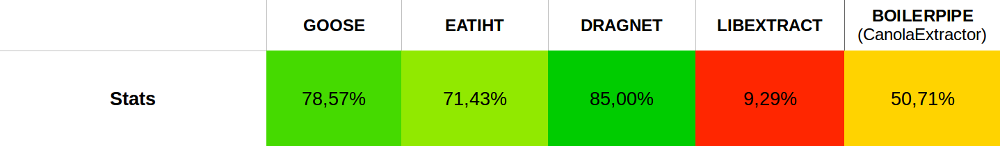

# [Notes]

- réflexion sur la mission et la manière dont vous vous êtes organisés
- réflexion sur les choix qui ont été faits
- réflexion sur la portée de vos réalisations, leurs avantages et inconvénients, leur devenir dans l'entreprise
- philosophie de l'open-source (contributions dans les 2 sens)

# Remerciements

Je tiens à remercier Guillaume Plique et Benjamin Ooghe-Tabanou pour leur très grande disponibilité tout au long du stage et pour tout ce que j'ai appris grâce à eux. 

# Résumé technique

Mon stage a principalement consisté en l'amélioration d'outils et de librairies utilisés pour répondre aux besoins de chercheurs traitant de grandes masses de données issues du web.

# 1. Un médialab à SciencesPo ?

## Un laboratoire un peu particulier

Le Médialab est un des 10 centres de recherche de SciencesPo. Laboratoire numérique, le Médialab a été créé en 2009 pour aider les sciences sociales et humaines à tirer le meilleur profit de la masse de données rendues disponibles par la numérisation. Ces données numériques sont au coeur des projets de recherche du labo : comment on perçoit/utilise les données numériques dans la société, ce qu'on en fait, quels outils on peut créer pour les collecter, les étudier, les exploiter, les visualiser, et ce, dans divers domaines (socio, histoire, art, ingénierie, design, pédagogie).
Il en ressort des productions de types très variés et peu courants pour un labo de sciences sociales : aux traditionnels "papiers" (articles, livres, working paper, OpEd...) s'ajoutent des applis,  des outils de collecte, d'exploration, de visualisation des données...

Constituée d'une trentaine de personnes, son équipe se distingue de celles des autres laboratoires de SciencesPo par sa grande diversité : chercheurs en sciences sociales, designers, ingénieurs pédagogiques et développeurs s'y côtoient.

Parmi les projets du laboratoire, on peut citer [La Fabrique de la Loi](https://www.lafabriquedelaloi.fr) qui propose une visualisation graphique des procédures parlementaires, le projet [Datapol](https://medialab.github.io/datapol/app/#!/) qui analyse les données numériques de la campagne présidentielle de 2017, ou [Dime Web](https://dime-shs.sciencespo.fr/instruments/dime-web/), qui vise à établir un ensemble d'outils open source permettant de collecter des données sur le web et sur les réseaux socieux (Twitter notamment).

*Laboratoires similaires ?*

## L'équipe

Paul, Guillaume, Benjamin, Jean-Philippe, Robin, Donato, Damien, Audrey, Diego

L'équipe technique du laboratoire se compose d'un directeur technique (Paul Girard), d'ingénieurs de recherche, de designers et de développeurs. L'organisation est très horizontale, et aucune hiérarchie ne transparaît au quotidien, les décisions étant prises en collectif.

J'ai principalement travaillé avec mon tuteur Guillaume Plique (développeur) et Benjamin Ooghe-Tabanou, ingénieur de recherche. 

*Donneurs d'ordre ? Comment l'info circule-t-elle ?*

*Technologies maîtrisées par l'équipe ?*

*Méthodes et outils utilisés (agile, git) ? Validation des développements (tests) ?*

L'équipe s'organise d'une part via une réunion hebdomadaire de tous les membres du laboratoire, où l'on partage les avancées et projets de chacun et où ont lieux des réflexions plus larges et globales sur le laboratoire, et d'autre part via la réunion technique, bimensuelle.

# Ma mission

## Le sujet

*Sujet initial*

Dans le cadre d'un projet de recherche de [Dominique Cardon](https://fr.wikipedia.org/wiki/Dominique_Cardon_(sociologue)) étudiant la polarisation de l'espace médiatique numérique français, le stage porte sur les techniques de récolte de données web (sites, réseaux sociaux) et de visualisation de celles-ci. 

*Ses évolutions (et leurs causes)*

Les besoins de collecte et de traitement de données étant multiples, j'ai été amené à travailler sur plusieurs outils.

*Situer le sujet dans les objectifs du labo*

Un des objectifs du laboratoire en termes de collecte de données est d'élargir son spectre de sources : les données récoltées proviennent actuellement de pages web (via le *crawler* [Hyphe](https://github.com/medialab/hyphe)) et de Twitter (via l'outil [Gazouilloire](https://github.com/medialab/gazouilloire)).

*Cahier des charges précis ou participation à son élaboration ?*

## Le planning

*Vous pouvez présenter le planning initial et le planning réel avec les dates importantes.
Quelles ont été les étapes importantes ? Indiquez celles qui auraient été les plus difficiles, les plus intéressantes, etc.*

Itérations de 2 semaines.

## Mes contributions

*Etat du projet à votre arrivée ? Et à la fin ?*

*Avez-vous réalisé une étude, une maquette, une preuve de concept, un produit ou une application complète ? Que reste-t-il à faire pour rendre utilisable votre travail ?*

## Outils & technologies

*Outils, environnements, logiciels*

Tout le travail effectué l'a été en Python ou en Javascript. En Python, le gestionnaire d'environnement virtuels pyenv a été utilisé, pour compartimenter la version de Python et les dépendances de propres à chaque projet. 

Concernant les bases de données, ont été utilisés Elasticsearch (ainsi que son interface de visualisation et de monitoring Kibana) et MongoDB.

Pour le développement d'interfaces, React et material-ui ont été plébiscités, ainsi que Recharts pour la visualisation de données.

*Comment les développements ont été vérifiés/testés/validés ?*

La plupart des projets comportent des tests unitaires, qui sont vérifiés grâce au logiciel d'intégration continue Travis CI.

## Prise de recul

*Quel a été l'intérêt de votre travail pour l'entreprise ? Que va devenir votre contribution ? Présenter les perspectives.
Quelles sont les améliorations à envisager ? Quelle est la maintenance à prévoir sur cette réalisation ou cette application ?
Selon les cas, présentez vos réflexions sur **l'impact de votre travail sur les utilisateurs**, les nouveaux usages, le respect de la **vie privée** ou de l'environnement...*

# Le travail réalisé

*Cette partie est la plus longue ; vous y présenterez votre travail.
Si besoin, vous pourriez structurer le reste du rapport en plusieurs parties et non une seule. La ou les parties devraient elles-mêmes êtres structurées en plusieurs sous-sections au sein d'une même partie. Dans tous les cas, la logique du plan doit apparaître clairement.
Travaillez les liaisons pour aboutir à une lecture fluide. Voici un exemple (un peu exagéré) : "Après avoir inventorié les technologies disponibles dans la section précédente, cette section est consacrée aux expérimentations que nous avons menées avec chacune d'elles. Ce travail nous permettra de sélectionner les technologies retenues, présentées dans la section suivante."
Présentez votre réflexion et vos choix, qui devraient être justifiés. Examinez rapidement les autres alternatives.
Sélectionnez les détails pertinents et laissez les autres en annexe. Allez du général au particulier. Evitez de présenter un catalogue des fonctions développées.*

### Hyphe

### Gazouilloire

Utilisé en permanence par le laboratoire, Gazouilloire est un outil de collecte de tweets selon certains critères (mots-clés, période, langage...). Imaginons que l'on souhaite étudier la polémique autour de Parcoursup ; il suffit de lancer une collecte sur le mot-clé `'parcoursup'` . En utilisant une clé d'API Twitter (générée via un compte développeur), l'outil va collecter les tweets contenant ce mot-clé, à la fois en direct (`stream`) et en remontant dans le passé ( `search` - sur quelques jours seulement, la limite étant fixée par l'API). Gazouilloire formate ensuite les champs récupérés pour chaque tweet (plus d'une cinquantaine : contenu texte, hashtags, auteur, date...) et les indexe dans une base de données.

##### Pourquoi changer de base de données ?

MongoDB est un système de gestion de base de données très souple, et adapté au stockage de grandes masses de données. La limitation : la vitesse de lecture (indexation limitée), qui rend toute aggrégation impossible à partir d'une centaine de milliers de documents.

##### Comment changer de base de données ?

### Extraction du contenu texte à partir de HTML

Une des problématiques récurrentes rencontrée par les chercheurs du laboratoire consiste en l'analyse du contenu d'un corpus de pages web.

Mettons-nous à la place d'un chercheur souhaitant analyser un ensemble d'articles de presse traitant de la santé, pour pouvoir ensuite les trier par sujet et identifier quelle page traite du glyphosate, des compteurs Linky ou des cabines à UV. Une première question d'ordre technique se pose : notre chercheur, face à sa liste de 10 000 urls, doit d'abord récupérer le contenu texte des articles, mais n'est pas très enthousiaste à l'idée de visiter chaque page et de copier son contenu à la main. Heureusement, cela s'automatise. Mais l'automatisation n'est pas évidente : comment notre programme fait-il la différence entre le contenu de l'article et les commentaires, l'en-tête du site, la liste des catégories ? Si encore tous les sites web avaient la même structure, on aurait pu établir des règles génériques (identifier la balise HTML contenant le texte). C'est évidemment loin d'être le cas.

La problématique d'extraction de contenu texte à partir de HTML étant récurrente, il existe différents outils open-source y répondant, fonctionnant pour la plupart à l'aide d'heuristiques : Goose, Boilerpipe, eatiht, Dragnet, libextract... Mais quelle est la librairie la plus performante ?

L'évaluation automatisée des performances de tels outils est difficile à mettre en oeuvre puisqu'il n'y a pas de moyen simple de déterminer si le contenu extrait est bien le texte de l'article ou non. On peut évidemment établir une liste d'heuristiques se basant sur des mots-clés ("Error 404", "Cloudflare" ...) ou sur la taille du résultat, mais cela n'écarte que les cas d'échec les plus simples et nécessite tout de même un certain temps à mettre en place. Une alternative simple consiste donc à implémenter toutes les librairies dans un script Python affichant le résultat des différentes extractions, pour un fichier HTML tiré au hasard. En donnant un score (la notation étant forcément subjective mais commune) à chaque méthode, 

J'ai donc implémenté les différents outils dans un script Python affichant les résultats des différentes extractions, pour un fichier HTML tiré au hasard, afin d'évaluer rapidement la qualité des résultats.

Pour déterminer cela, j'ai téléchargé le HTML brut d'un corpus d'urls issus d'un travail de recherche, pour constituer un ensemble de pages sur lesquelles tester ces librairies. 

-> Multithreading 

 

### Urlsresolver

### Facebook

### Graphology

### Ural

# Conclusion

*La conclusion devrait faire de une à deux pages.
En général, on commence par présenter un résumé du rapport puis les perspectives et éventuellement les travaux restant à mener.
Vous pouvez ensuite exposer les points positifs et négatifs de votre stage.
Enfin, vous pouvez re-situer votre stage dans votre parcours de formation et dans votre projet professionnel. Vos objectifs ont-ils évolué ? Par exemple, en quoi ce stage confirme (ou infirme) votre choix de filière ?*

# Bibliographie

https://stph.scenari-community.org/contribs/nos/es3/co/es3.html 

# Glossaire

# Annexes
