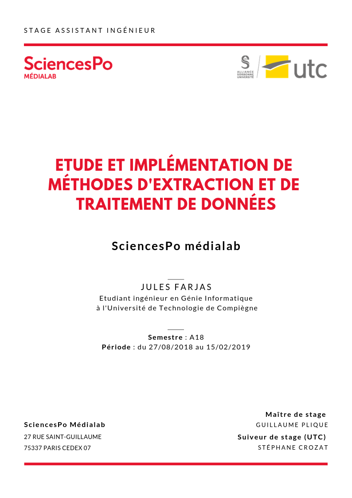
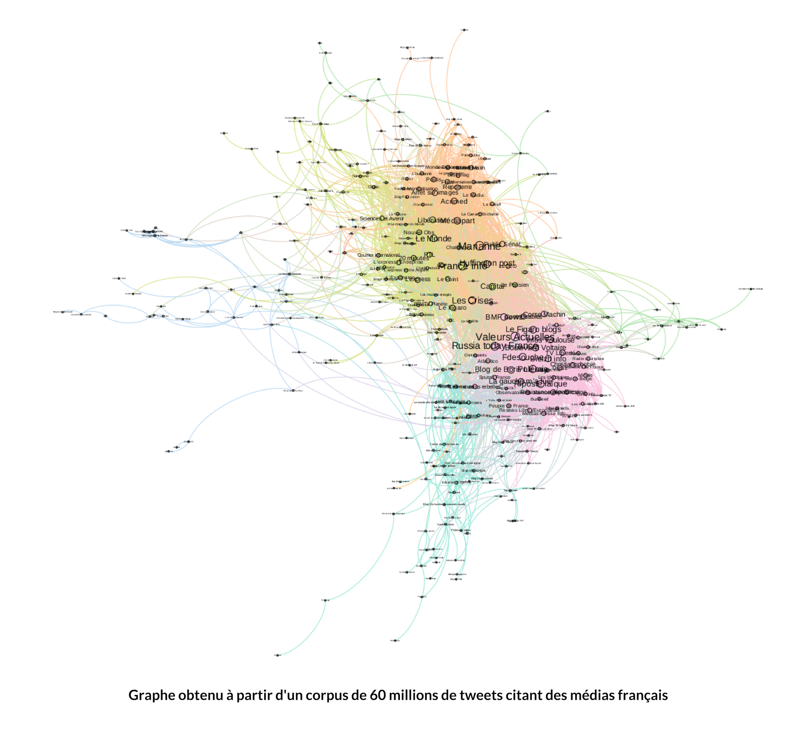
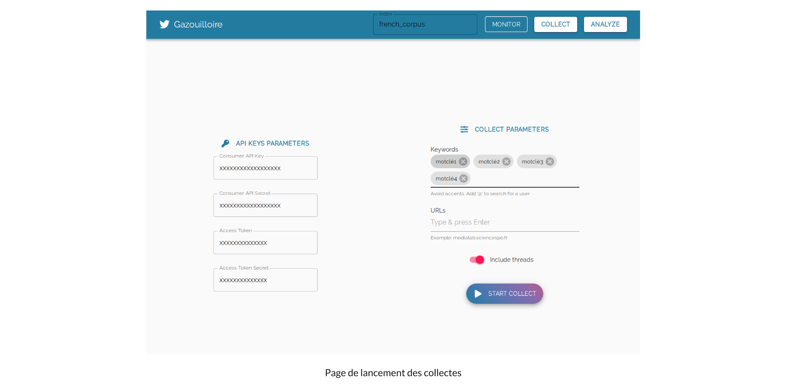

# Remerciements

Je tiens tout d'abord à remercier mes collègues de bureau Guillaume Plique et Benjamin Ooghe-Tabanou pour leur très grande disponibilité tout au long du stage et pour tout ce que j'ai appris grâce à eux.

J'ai eu la chance de faire mon stage sous le tutorat de Guillaume qui, sans aucune exagération, excelle par son niveau de compétences et sa pédagogie. Merci pour toute les réponses éclairées à mes nombreuses questions.

Je remercie également Paul et l'équipe de m'avoir fait confiance pour ce stage.

Enfin, merci à Barbara, Damien, Robin, Jean-Philippe, Arnaud, Donato, Léna, Audrey, Diego ainsi que toute l'équipe auprès de qui travailler pendant ces six mois fut un réel plaisir.


# Sommaire

- [**Remerciements**](#remerciements)

 - [**Sommaire**](#sommaire)

 - [**Résumé technique**](#résumé-technique)

 - [**Introduction**](#introduction)

 - [**1. Un médialab à SciencesPo ?**](#1-un-médialab-à-sciencespo-)
   - [1.1 Un laboratoire un peu particulier](#11-un-laboratoire-un-peu-particulier)
   - [1.2 L'équipe](#12-léquipe)

 - [**2. Le sujet**](#2-le-sujet)
   - [2.1 Récolter des données web pour étudier la polarisation de l’espace médiatique](#21-récolter-des-données-web-pour-étudier-la-polarisation-de-lespace-médiatique)
   - [2.2 Outils & technologies](#22-outils--technologies)

 - [**3. Réalisations**](#3-réalisations)
   - [3.1 Collecte de données](#31-collecte-de-données)
     - [3.1.1 Twitter](#311-twitter)
     - [3.1.2 Facebook](#312-facebook)
   - [3.2 Traitement de données](#32-traitement-de-données)
     - [3.2.1 Normalisation des urls](#321-normalisation-des-urls)
     - [3.2.2 Extraction du contenu pertinent d'une page web](#322-extraction-du-contenu-pertinent-dune-page-web)
     - [3.2.3 Création d'une librairie & outil en ligne de commande Python](#323-création-dune-librairie--outil-en-ligne-de-commande-python)

 - [**Conclusion**](#conclusion)

 - [**Glossaire**](#glossaire)

# Résumé technique

*Mon stage a principalement consisté en l'amélioration d'outils et de librairies destinées à répondre aux besoins de chercheurs traitant de grandes masses de données issues du web. Tous les développements ont été réalisés en Python ou en Javascript, et publiés en open-source. Mes travaux ont porté sur un outil de collecte de tweets, que j'ai migré d'une base MongoDB à une base Elasticsearch ainsi que de Python 2 à Python 3, et pour lequel j'ai développé une interface (à l'aide de React et d'un serveur Flask). J'ai également développé des scripts Python récupérant le nombre de partages Facebook pour une url donnée, et benchmarké puis implémenté des méthodes d'extraction de contenu texte pertinent dans une page HTML. J'ai aussi contribué à l'élaboration d'une librairie de traitement d'urls. Pour finir, j'ai réuni ces scripts dans un outil en ligne de commande développé en Python.*


# Introduction

Dans le milieu de la recherche en sciences humaines et sociales (SHS), l'émergence d'Internet offre une nouvelle prise sur les questions fondamentales de la théorie sociale et sur l'étude des médias. Le dynamisme des réseaux sociaux, les multiples sites de presse générale ou "alternative" et autres médias d'opinion sont autant de données produites en permanence et disponibles en masse. Ces données sont par exemple l'opportunité de vérifier empiriquement des théories de sciences sociales, d'identifier des tendances, des réseaux. Cependant, cette précieuse matière première est disponible de façon brute, forme sous laquelle elle n'est guère utilisable par un chercheur en SHS sans compétences en informatiques. Ces données se collectent, se formatent, se traitent à l'aide d'outils et de technologies spécifiques : c'est l'objet de ce rapport.


# 1. Un médialab à SciencesPo ?

## 1.1 Un laboratoire un peu particulier

Le médialab est un des 10 centres de recherche de SciencesPo. Laboratoire numérique, le médialab a été fondé en 2009 par le sociologue et philosophe [Bruno Latour](https://fr.wikipedia.org/wiki/Bruno_Latour) pour aider les sciences sociales et humaines à tirer le meilleur profit de la masse de données rendues disponibles par la numérisation. Comment perçoit-on/utilise-t-on les données numériques dans la société ? Qu'en fait-on ? Quels outils peut-on créer pour les collecter, les étudier, les exploiter, les visualiser, dans des domaine aussi variés que la sociologie, l'histoire, l'art, l'ingénierie, le design et la pédagogie ?
Il en ressort des productions de types très variés et peu courants pour un laboratoire de sciences sociales : aux traditionnels articles s'ajoutent des applis, des outils de collecte, d'exploration, de visualisation des données...

Constituée d'une trentaine de personnes, son équipe se distingue de celles des autres laboratoires de SciencesPo par sa grande diversité : chercheurs en sciences sociales, designers, ingénieurs pédagogiques et développeurs s'y côtoient.

Parmi les projets du laboratoire, on peut citer [La Fabrique de la Loi](https://www.lafabriquedelaloi.fr) qui propose une visualisation graphique  et détaillée des procédures parlementaires, le projet [Datapol](https://medialab.github.io/datapol/app/#!/) qui analyse les données numériques de la campagne présidentielle de 2017, ou [Dime Web](https://dime-shs.sciencespo.fr/instruments/dime-web/), qui vise à établir un ensemble d'outils open source permettant de collecter des données sur le web et sur les réseaux sociaux (Twitter notamment).

On peut citer comme laboratoires similaires le [Digital Methods Initiative](https://wiki.digitalmethods.net/) d'Amsterdam, l'[Oxford Internet Institute](https://www.oii.ox.ac.uk/), le [TANT-Lab](https://www.tantlab.aau.dk/) danois, ainsi que le [MIT Center for Civic Media](https://civic.mit.edu/) et le [Berkman Klein Center for Internet & Society](https://cyber.harvard.edu/), qui travaillent notamment sur la suite d'outils [Media Cloud](https://mediacloud.org/) répondant aux mêmes types de problématiques abordées par le médialab. Ces deux laboratoires américains diffèrent cependant du médialab sur certains points, notamment l'effectif - le *Berkman Klein Center* compte plus de 200 personnes - et les financements - le médialab du MIT est financé entièrement par des sponsors.


## 1.2 L'équipe

L'équipe technique du laboratoire se compose d'un directeur technique (Paul Girard), d'ingénieurs de recherche, de designers et de développeurs. L'organisation est très horizontale, et aucune hiérarchie ne transparaît au quotidien.

L'équipe s'organise d'une part via une réunion hebdomadaire de tous les membres du laboratoire, où l'on partage les avancées et projets de chacun et où ont lieux des réflexions plus larges et globales sur le laboratoire, et d'autre part via la réunion technique, bimensuelle. C'est pendant cette réunion technique que sont gérés les projets en cours et à suivre, via une méthode agile.

J'ai principalement travaillé avec deux ingénieurs de recherche : mon tuteur Guillaume Plique et Benjamin Ooghe-Tabanou, présents quotidiennement dans le même bureau que le mien.

Les objectifs de long terme sont déterminés en commun avec mon tuteur, tandis que les tâches annexes et ponctuelles, comme le traitement d'un corpus spécifique, sont principalement définies par mail ou de vive-voix.

La très grande majorité des outils développés par le laboratoire le sont en Python ou en Javascript. Des frameworks comme React sont utilisés, ainsi que des outils de déploiement et d'intégration comme Gitlab CI, Docker, Rancher. Tous les outils développés le sont en open-source, et sont publiés sur le [repo du laboratoire](https://github.com/medialab) le plus souvent sous licence AGPL-3.0, GPL-3.0 ou MIT.


# 2. Le sujet

## 2.1 Récolter des données web pour étudier la polarisation de l’espace médiatique

Dans le cadre d'un projet de recherche de [Dominique Cardon](https://fr.wikipedia.org/wiki/Dominique_Cardon_(sociologue)) étudiant la polarisation de l'espace médiatique numérique français, le stage porte sur les techniques de récolte de données web (sites, réseaux sociaux) et de visualisation de celles-ci. 

La *polarisation de l'espace médiatique* ? Pour saisir les intentions de ce projet de recherche, il faut partir d'une étude du [Berkman Klein Center for Internet & Society]((https://cyber.harvard.edu/)) sur la campagne présidentielle américaine de 2016. En étudiant la façon dont les médias s'intercitent et la façon dont ils sont partagés en ligne, le laboratoire a conclu à une très forte polarisation, où d'un côté la gauche et le centre se rapprochent quand de l'autre la droite s'éloigne un peu plus vers la droite.  Il s'agit en quelque sorte de vérifier de façon empirique, sur de grandes quantitées de données, des hypothèses sociologiques.

Le but de ce projet de recherche du médialab, qu'on appellera le projet *Polarisation* dans la suite, est de répliquer cette analyse sur l'espace médiatique français. Comment une polémique d'actualité comme l'affaire Benalla se diffuse au travers des différents médias ? Les mêmes thèmes sont-ils abordés partout ? 

Concrètement, cette polarisation s'étudie via la construction de réseaux : on peut par exemple établir un graphe de médias à partir des partages de liens sur les réseaux sociaux. Ainsi, deux médias seront liés si le même profil de personnes les partagent. Un tel graphe permet ensuite d'identifier des groupes, ou pôles, dans l'espace médiatique.



Afin d'établir ce genre de visualisations, il est nécessaire de collecter et de traiter les données du corpus étudié : c'est ma mission en tant qu'assistant ingénieur.

Les besoins de collecte et de traitement de données étant multiples, j'ai été amené à travailler sur plusieurs outils, répondant chacun à un besoin particulier mais relevant du domaine du web-mining : collecter de grandes quantités de tweets, récupérer des données de partages Facebook, extraire le contenu pertinent d'une page web, normaliser des urls.

Un des objectifs du laboratoire en termes de collecte de données est d'élargir son spectre de sources : les données récoltées proviennent actuellement de pages web (via le *crawler* [Hyphe](https://github.com/medialab/hyphe)) et de Twitter (via l'outil [Gazouilloire](https://github.com/medialab/gazouilloire)). Une partie importante de l'espace médiatique numérique échappe donc aux outils du laboratoire : Facebook, LinkedIn, Instagram par exemple. Un des buts de ce stage est aussi de répondre aux besoins ponctuels récurrents des chercheurs, comme extraire le contenu d'un ensemble de pages web pour effectuer de l'analyse textuelle par exemple.


## 2.2 Outils & technologies

**Outils, environnements et logiciels**

Tout le travail effectué l'a été en Python ou en Javascript. En Python, le gestionnaire d'environnement virtuels pyenv a été utilisé, pour compartimenter la version de Python et les dépendances propres à chaque projet. 

Concernant les bases de données, ont été utilisés Elasticsearch (ainsi que son interface de visualisation et de monitoring Kibana) et MongoDB.

Pour le développement d'interfaces, React et material-ui ont été plébiscités, ainsi que Recharts pour la visualisation de données.

**Vérifications et tests**

La plupart des librairies comportent des _tests unitaires_*, qui sont vérifiés grâce au logiciel d'intégration continue Travis CI. Les développements de nouvelles fonctionnalités ont été faits sur des branches dédiées sur git, puis envoyés sous forme de Pull Requests avant d'être mergées à la branche master.


# 3. Réalisations

## 3.1 Collecte de données

### 3.1.1 Twitter

#### 3.1.1.1 Fonctionnement de l'outil Gazouilloire

Pour récolter des tweets, le laboratoire utilise un outil maison, [Gazouilloire](https://github.com/medialab/gazouilloire). 

Gazouilloire est un outil de collecte de tweets selon certains critères (mots-clés, hashtag, période, langage...). Imaginons que l'on souhaite étudier la polémique autour de Parcoursup et collecter les tweets liés au sujet ; il suffit de lancer une collecte sur le mot-clé `'parcoursup'` . En utilisant une clé d'API Twitter (générée via un compte développeur), l'outil va collecter les tweets contenant ce mot-clé, à la fois en direct (`stream`) et en remontant dans le passé ( `search` ). L'API Twitter étant limitée à une dizaine de jours de retour dans le passé, un chercheur souhaitant étudier un sujet sur plusieurs semaines ou plusieurs mois devra faire tourner sa collecte sur la durée souhaitée.

Gazouilloire formate ensuite les champs récupérés pour chaque tweet (plus d'une cinquantaine : contenu texte, hashtags, auteur, date...) et les stocke dans une base de données.


Techniquement, Gazouilloire est un outil écrit en Python 2, faisant appel à une base de données MongoDB.

Mon travail a d'abord consisté à rendre l'outil compatible Python 3, tout en gardant la compatibilité avec Python 2, puis à migrer vers une base de données Elasticsearch.


#### 3.1.1.2 Ébauche d'une interface

##### Quels besoins ?

Gazouilloire est un outil en ligne de commande, qui se lance donc via un terminal. Les paramètres de la collecte (mots-clés, hashtags, période, ...) sont entrés dans un fichier JSON avant le lancement du programme. Cela le rend difficilement accessible aux chercheurs en sciences sociales n'ayant pas de formation en informatique. 

En outre, une interface de visualisation rapide des données stockées dans la base de données serait bienvenue, afin d'identifier des tendances ou de repérer d'éventuels problèmes.

Enfin, la possibilité de surveiller l'état des collectes directement dans l'interface faciliterait grandement le suivi de celles-ci. 

##### Quelles technologies ?

Il faut distinguer les différentes composantes nécessaires au fonctionnement de l'interface de l'application.

- un client, qui gère l'interface graphique (développé en Javascript)
- un serveur simple (développé en Python, grâce au framework Flask)
- une base de données (ici, MongoDB)


**L'interface utilisateur**

Pour le développement de l'interface, le choix d'un librairie comme [React](https://reactjs.org/) se révèle pertinent. Le recours au framework [material-ui](https://material-ui.com/) permet d'utiliser des composants pré-existants à la fois fonctionnels, esthétiques et responsive*. 


React est une bibliothèque Javascript libre développée par Facebook qui vise à faciliter la création d'interface d'applications web. Elle est notamment utilisée par Netflix, Yahoo, Airbnb, Sony ainsi que WhatsApp et Instagram (appartenant à Facebook).[^fn1]

React fonctionne par la création de composants réutilisables, possédant chacun un état pouvant évoluer avec le temps. Avec React a été développé un langage, le [JSX](https://reactjs.org/docs/introducing-jsx.html), hybride entre Javascript et HTML. Le JSX permet de générer des objets Javascript avec une notation similaire à celle du HTML :

```jsx
const element = <h1>Hello, {name}</h1>;
```

Une des particularités de React est l'utilisation d'un DOM* virtuel : plutôt que de regénérer tout le DOM à chaque modification de la page, le DOM est représenté comme une arborescence d'objets Javascript, ce qui permet à React de détecter la moindre modification de la page. Une fois la modification identifiée, React interagit avec le DOM pour ne changer que ce qui est nécessaire.

Dans une perspective d'usages multiples (collecte, analyse et monitoring), l'application se doit de dédier une page (ou onglet) à chacun de ceux-ci. Cela peut se faire via un élément cliquable comme un bouton, dans lequel on indique une url pointant vers la page voulue.


Il reste à afficher le bon contenu lorsqu'on accède à l'url en question.

Cela peut se faire grâce à un routeur comme `react-router-dom` :

```jsx
import {BrowserRouter as Router, Route} from 'react-router-dom';

<Router>
	<Route path="/collect" component={CollectPage} />
	<Route path="/analyze" component={AnalyzePage} />
	<Route path="/monitor" component={MonitoringPage} />
</Router>
```

Ici, `CollectPage`, `AnalyzePage` et `MonitoringPage` sont des composants contenant tous les éléments affichés respectivement sur les pages de collecte, d'analyse et de monitoring.

On souhaite ici afficher des visualisations de données dans le composant `AnalyzePage`. Il existe pour cela plusieurs librairies Javascript : [D3.js](https://d3js.org/), [Chart.js](https://www.chartjs.org/), [Chartist.js](https://gionkunz.github.io/chartist-js/) ou [Recharts](http://recharts.org/en-US/) pour en citer quelques-unes.

Le choix s'est ici porté sur Recharts, pour sa logique basée sur des composants React. Recharts se base sur D3.js, largement répandu mais moins évident à utiliser.

Le choix de Recharts s'est révélé payant pour l'implémentation de graphiques simples (bar charts, pie charts & line charts), mais la personnalisation des composants s'est révélée ardue. Concernant le graphique du nombre de tweets par jour, il m'a fallu manuellement coder une fonction de zoom dynamique (sur une période choisie à la souris) par exemple.

**Le serveur**

Toutes les visualisations présentes dans l'interface ne sont à la base que des données. Il faut donc bien que le client aille chercher ces données quelque part : il va les demander au serveur.

La mission du serveur est simple : répondre aux requêtes du client avec les données adéquates.

C'est lui qui va gérer la connexion et les requêtes faites à la base de données, et les renvoyer dans un format adapté au client.

Le choix s'est porté sur le microframework [Flask](http://flask.pocoo.org/), pour sa simplicité - il suffit d'un fichier Python - et sa légèreté.

```python
@app.route("/timeevolution")
def getDayCount():
    days = [day for day in mongo.db.tweets.aggregate("REQUETE D'AGGREGATION PAR DATE")]
    return make_response(jsonify(days))
```

Il suffit alors, du côté du client, de faire une requête à la route indiquée pour récupérer les données :

```javascript
fetch('adresse_du_serveur/timeevolution')
```

On est alors en mesure d'obtenir une interface fonctionnelle :




Cependant, comme détaillé en 3.1.1.4, l'établissement de cette interface de visualisation simple a permis de mettre en avant d'importantes limitations de la configuration actuelle de l'outil. Ces conclusions ont mené à lancer deux chantiers de plus grande ampleur : la migration vers Elasticsearch, et le passage de l'outil de Python 2 à Python 3.


#### 3.1.1.3 Passage de Python 2 à Python 3

Le support de Python 2 s'arrêtant officiellement en 2020, et Python 2 étant une source de problèmes éventuels (d'encodage, de compatibilité si intégration de nouvelles dépendances/librairies), la migration vers Python 3 s'impose. On souhaite cependant conserver une pleine compatibilité avec Python 2, pour éviter tout _breaking-change*_.

**Futurize**

Basé sur les librairies [2to3](https://docs.python.org/2/library/2to3.html), [3to2](https://pypi.org/project/3to2/) et [python-modernize](https://python-modernize.readthedocs.io/en/latest/), [futurize](https://python-future.org/automatic_conversion.html) est un script du projet `python-future`, qui vise à assurer une compatibilité Python 2 et 3. `python-future` s'installe ainsi :

```bash
pip install future
```

`futurize` agit en 2 étapes : une première qui ne fait que des changements conservant une compatibilité totale avec Python 2 (parenthèses aux `print`, division entière, ...). La seconde étape se base sur une dépendance à `future`. 

```bash
futurize --stage1 -w script.py
```

```bash
futurize --stage2 --unicode-literals -w script.py
```

L'option `-w` permet d'appliquer directement les changements nécessaires au fichier, et `--unicode-literals` permet de considérer par défaut toutes les `string` comme du texte (`str` en Python 3, `unicode` en Python 2), et non du binaire.

**Vérifier le reste à la main**

Habituellement, d'autres problèmes ont besoin d'être résolus avant d'avoir une réelle compatibilité Python 2 & 3 ; typiquement la compatiblité des dépendances elles-mêmes.

Ici, Gazouilloire fait appel à la librairie [urlsresolver](https://github.com/phpdude/python-urlsresolver), utilisée pour résoudre les liens raccourcis présents dans les tweets, et stocker les liens réels. qui n'est compatible qu'avec Python 2. 

C'est l'occasion d'expérimenter concrètement ce qu'est le milieu de l'open source libre : le code d'urlsresolver étant accessible à tous sur un repo Github, il est possible de _cloner_* le repo et d'en modifier le code de son côté.

```bash
git clone git@github.com:phpdude/python-urlsresolver.git
```

J'ai donc modifié la librairie pôur la rendre compatible Python 3, ajouté des _tests unitaires_* pour s'assurer que le code reste fonctionnel de Python 2.7 à Python 3.7, et effectué une _Pull Request_* au créateur de la librairie ([@phpdude](https://github.com/phpdude)). Ce dernier m'a répondu, a étudié ma Pull Request et l'a acceptée, ajoutant ainsi mes modifications à la librairie.


#### 3.1.1.4 Migration de MongoDB à Elasticsearch


##### Pourquoi changer de base de données ?

MongoDB est un système de bases de données non-relationnelles, très souple à l'usage : nul besoin de spécifier à l'avance le format des données que l'on va insérer dans la base, par exemple. Il est ainsi possible d'insérer l'objet `{Nom : "Davis", Prénom : "Miles"}` puis l'objet `{Nom : "Parker", Prénom : "Charlie", Lieu de naissance : "Kansas City"}` sans redéfinir la base en ajoutant un champ `Lieu de naissance`.  Une caractéristique particulièrement intéressante dans le cas de Gazouilloire : parmi la cinquantaine de champs potentiellement stockés par tweet (auteur, contenu, hashtags, ...), plusieurs ne seront pas présents dans tous les cas, comme la géolocalisation. MongoDB nous permet donc de stocker chaque tweet avec les informations qu'il possède sans se soucier des champs qu'il possède.

S'il permet de stocker rapidement de grandes quantités de données, l'accès à ces données en lecture (une fois stockées) est en revanche limité en vitesse. Cela est particulièrement vrai pour les requêtes d'_agrégation_*. Une requête d'agrégation va consister à grouper tous les enregistrements (ici, tweets) qui répondent à un critère : par exemple, qui datent du jour J. MongoDB n'utilisant pas d'indexation par défaut, cela nécessite de chercher dans toute la base les enregistrements correspondant.

Ce qui n'est pas problématique si l'on veut afficher une liste de 100 tweets, mais qui devient très handicapant lorsque l'on souhaite afficher la distribution temporelle d'un corpus de 2 millions de tweets.

Illustration sur une requête d'agrégation temporelle destinée à afficher une courbe du nombre de tweets par jour, sur un corpus de 2 millions de tweets :

| MongoDB       | Elasticsearch |
| ------------- | ------------- |
| 26,7 secondes | 120 ms        |

Avec MongoDB et des corpus dépassant les centaines de milliers de documents, l'interface devient inutilisable. Il était donc nécessaire de migrer vers une base de données Elasticsearch.


##### Comment changer de base de données ?

​	**Étape 1 - Identifer les différences de structure**

MongoDB possède une arborescence à 2 niveaux : on peut créer plusieurs `databases`, lesquelles contiennent une ou plusieurs `collections`. Dans Gazouilloire, une collecte correspond à une `database`, contenant une `collection` _"tweets"_ et une collection _"links"_ (stockant les liens contenus dans les tweets).

Elasticsearch ne fonctionne qu'à un seul niveau, celui des `index` (équivalent des `databases` Mongo), sans sous-index ou équivalent des `collections`.

La solution retenue ici est de créer deux `index` pour chaque collecte, un pour les tweets et un pour les liens :


​	**Étape 2 - Construire une base de données Elasticsearch**

Bien évidemment, il faut avant toute chose [installer Elasticsearch](https://www.elastic.co/guide/en/elasticsearch/reference/current/install-elasticsearch.html), ainsi que son client Python (`pip install elasticsearch`) dans notre cas.

On souhaite se construire une base de données Elasticsearch contenant des tweets (sans avoir à migrer au préalable toute la machinerie de collecte), afin de tester le fonctionnement de l'interface avec cette base.

L'idéal est de réaliser un script requêtant tous les enregistrements de la Mongo et les indexant dans Elasticsearch, afin de construire une base de test identique à la Mongo, et ainsi de s'assurer que les résultats des requêtes sont les mêmes quel que soit le type de base.

Il faut donc d'abord créer un index Elasticsearch : 

```python
es.indices.create(index='test-index', body=mappings)
```

La variable `mappings` est importante : la bibliothèque sur laquelle est basée Elasticsearch, Lucene, a besoin de savoir comment lire les données qu'elle stocke. Pour cela, il faut établir un _mapping_ à la création de chaque index. Celui-ci définit, entre autres, le type de chaque champ de l'index :

```json
"mappings": {
    "favorite_count": {
            "type": "integer"
    },
    "timestamp": {
        "type": "date",
        "format": "epoch_second"
    },
    "text": {
        "type": "text"
    },
    "lang": {
        "type": "keyword"
    },
    ...
}
```

Les mappings sont déterminés automatiquement s'ils ne sont pas spécifiés, mais cela menant souvent à des erreurs (entiers pris pour des chaînes de caractères par exemple), il est déconseillé de procéder ainsi.

> On notera aussi la différence entre les types `"text"` et `"keyword"` : les champs de type `text` sont analysés (découpés en une liste de termes individuels) avant d'être indexés, ce qui permet ensuite de rechercher un mot en particulier _à l'intérieur_ du texte stocké. Il n'est en revanche pas possible d'effectuer de requête de tri ou d'agrégation (grouper selon certains critères) sur un champ `text`, tandis que ça l'est avec un champ `keyword` (qui lui n'est pas analysé, donc pas recherchable autrement qu'avec sa valeur exacte).

​	**Étape 3 - Brancher l'interface sur la base de test**

Pour que l'interface puisse accéder aux données stockées dans Elasticsearch, il faut modifier le serveur Flask, en ajoutant des routes requêtant la base Elasticsearch.

```python
es = Elasticsearch('http://HOST:PORT')
```

```python
@app.route("/elastictimeevolution")
def getDayCount():
    data = es.search("REQUETE ELASTICSEARCH")
    return make_response(jsonify(days))
```

A noter que la forme des réponses Mongo et Elasticsearch n'étant pas les mêmes, il est souhaitable de formater les réponses dans le serveur pour qu'on puisse utiliser indifféremment des résultats provenant de Mongo ou d'Elasticsearch.

​	**Étape 4 - Abstraire la base de données**

Afin d'assurer une certaine lisibilité dans le code et la possibilité de choisir facilement entre une base Mongo ou Elasticsearch, a été fait le choix d'abstraire la base de données. Abstraire la base de données, c'est utiliser un objet générique - qu'on peut appeler `Database`  - possédant les méthodes nécessaires au fonctionnement de Gazouilloire (`find`, `update`, `count` par exemple), et qui effectue les bonnes requêtes selon le type de base choisie.

Les deux classes n'ayant que très peu de méthodes et attributs communs, l'option d'une classe abstraite dont hériteraient deux sous-classes n'est pas réellement pertinente. Il a donc été fait le choix d'implémenter deux classes `MongoManager` et `ElasticManager` indépendantes, mais possédant les mêmes méthodes.


Dans le script principal, il suffit alors d'utiliser `DBManager` pour instancier une base de données du type souhaité :

```python
db = db_manager(db_type) # db_type = 'mongo' ou 'elasticsearch'
```

```python
db.update(tweet, value) # Utilise la requête d'update adéquate
```

Il reste à écrire les méthodes de chaque classe, avec les requêtes adéquates.

​	**Étape 5 - Optimiser les performances**

Tout d'abord, afin d'optimiser la vitesse d'indexation, il est possible d'effectuer les requêtes par paquets (_bulk_indexing_).

Avec le client Python, l'idéal est d'avoir un _générateur_* de requêtes : 

```python
 def stream_tweets(tweets, index):
        """Yields an update action for every tweet of a list"""
        for tweet in tweets:
            yield {
                "_id": tweet["_id"],
                "_type": "tweet",
                "_index": index,
                "_op_type": "update",
                "_source": {
                    "doc": format_tweet_fields(tweet)
                }
            }
```

Ici, `stream_tweets` génère une requête mettant à jour l'enregistrement correspondant à l'id spécifié avec le contenu fourni (préalablement formaté) pour chaque tweet dans `tweets`. Il suffit ensuite d'utiliser ce générateur de requêtes dans un `streaming_bulk` :

```python
from elasticsearch import helpers

es = Elasticsearch("HOST:PORT")

tweets_collectes = [tweet1, tweet2, tweet3, ...]

helpers.streaming_bulk(es, actions=stream_tweets(tweets_collectes))
```

Problèmes de vitesse mis à part, la quantité d'informations stockées doit aussi être prise en compte. Un outil de collecte comme Gazouilloire peut facilement être amené à collecter 1, 10 voire 100 millions de tweets, ce qui représente plusieurs dizaines voire centaines de gigas. _Lucene*_, et donc Elasticsearch, fonctionne en Java ; pour de très gros corpus, il est nécessaire de modifier sa configuration par défaut. Cela concerne en particulier la taille de la mémoire virtuelle Java (ou _JVM heap size_), qui sature si le corpus est trop important :


Par défaut à 1GB, il faut augmenter sa valeur pour des corpus de plus de 15 millions (cela se fait dans le fichier `/etc/elasticsearch/jvm.options` ).

##### Les avantages d'Elasticsearch : Kibana

Outre les points de performance évoqués plus haut, un des points forts d'Elasticsearch est le fait qu'on puisse lui joindre [Kibana](https://www.elastic.co/fr/products/kibana), le greffon de visualisation de données de la suite Elastic. Cela facilite grandement l'exploration de données, ainsi que le monitoring de chaque index. Kibana fournit en effet un onglet _Discover_, permettant d'effectuer des requêtes de recherche et de voir les résultats ainsi que leur distribution temporelle, un onglet _Visualize_ permettant de construire bar charts, line charts, pie charts et word clouds, et un onglet Monitor affichant taille des index, vitesse d'indexation et nombre de documents.


### 3.1.2 Facebook

SI le laboratoire dispose d'un outil bien établi pour la collecte de tweets, ce n'est pas le cas pour la collecte de données Facebook. Twitter étant moins utilisé que Facebook, et pas forcément représentatif de la population, la question d'un biais dans les données récoltées se pose. Pour réduire celui-ci, ou du moins évaluer les différences entre les métriques de partage sur Facebook et sur Twitter, il est intéressant de pouvoir récupérer le nombre de partage Facebook pour telle url.

#### 3.1.2.1 La méthode utilisant l'API

Facebook fournit la [Graph API](https://developers.facebook.com/docs/graph-api/), principal point d'entrée des développeurs souhaitant lire (ou écrire) des données Facebook. Utiliser l'API nécessite un compte développeur Facebook, qui fournit les clés _App ID_ et _App Secret_, utilisées pour effectuer les requêtes. 

Le but ici est de récupérer les données d'activité pour un lien partagé sur le réseau, ce qui est possible via la [section URL](https://developers.facebook.com/docs/graph-api/reference/v3.2/url) de la Graph API. Ainsi, la requête suivante permet de récupérer le nombre de réactions, de commentaires, de partages et de commentaires externes pour une url donnée :

```bash
curl -i -X GET \
	https://graph.facebook.com/v3.1/?id=URL&fields=FIELDS&access_token=ACCESSTOKEN
```

> Un `ACCESSTOKEN` permanent peut être généré grâce aux clés du compte développeur : `ACCESSTOKEN` = `APPID|SECRETKEY`. Le champ  `FIELDS`  permet lui de spécifier les informations que l'on souhaite obtenir, dans notre cas `FIELDS` = `"engagement"`.

La réponse obtenue est de la forme suivante :

```json
{
  "engagement": {
    "reaction_count": 45315,
    "comment_count": 31742,
    "share_count": 25671,
    "comment_plugin_count": 3
  },
  "id": "https://www.imdb.com/title/tt0166924/"
}
```

Problème majeur de cette approche : les limitations en terme de nombre de requêtes imposées par l'API.

Après plusieurs essais, il apparaît que la _rate limit_ se trouve à un peu moins d'**une requête toutes les 15 secondes**, ce qui est extrêmement lent et totalement rédhibitoire pour tout usage massif. Pour illustration, il faudrait _3,5 jours_ pour récupérer les données de 10 000 urls, quand certains corpus de recherche se comptent plutôt en centaines de milliers d'entrées.

En outre, l'API est assez rigide sur l'url entrée en paramètre : si l'on veut être exhaustif, il faut faire la requête à la fois sur la page en http et la page en https, le résultat renvoyé n'étant pas le même. De même, les résultats diffèrent en fonction de la présence d'un  `/` final ou non.

#### 3.1.2.2 La méthode sans API

Il a fallu trouver une alternative à l'usage conventionnel de l'API. Celle-ci se trouve dans le détournement du bouton "Like" destiné aux pages web tierces :


On y accède via l'url suivante :

```
https://www.facebook.com/plugins/like.php?href=URL&layout=box_count
```

> À garder en tête, l'url cible (`URL`) doit être encodée avant d'être insérée dans l'adresse ci-dessus. Cet encodage peut se faire avec `quote` d'`urllib.parse` en Python, ou avec `encodeURI` en Javascript.

Il suffit alors de scraper la valeur du bouton et de la convertir en `integer` pour avoir le nombre de partages (arrondi) de l'url voulue. Et surtout, il n'y a pas de limites de requêtes (ce n'est pas dans l'intérêt de Facebook de limiter la diffusion de son réseau social sur les sites tiers) : la seule limite est celle de la connexion.

## 3.2 Traitement de données

Mettons-nous à la place du chercheur en sciences sociales souhaitant collecter des données de partage Facebook pour un corpus de liens sur un sujet en particulier. Celui-ci n'ayant potentiellement que des compétences de base en informatique, il va établir une liste d'urls en les copiant-collant de sources diverses, sans forcément se soucier des contraintes liées à un traitement ultérieur. Quelques exemples de ce qu'on peut trouver dans un même fichier d'urls :

- des urls en HTTP
- des urls en HTTPS
- des urls sans protocole
- des urls avec des détails non pertinents (des paramètres ou _queries_ comme `?utm_source=google`, des ancres ou _fragments_ comme `#2`)
- des urls avec des sous-domaines (comme `mobile`) ...

Autre besoin récurrent : le chercheur souhaitant déterminer quel média parle le plus de quel sujet devra analyser le contenu des pages web qui l'intéressent. Cela représente une autre tâche de traitement non négligeable : extraire le contenu pertinent d'une page web.

### 3.2.1 Normalisation des urls

Deux problèmes principaux se posent lorsque l'on travaille avec des urls :

- la diversité des éléments (facultatifs ou non) qui les composent (comme vu au-dessus)
- le fait qu'une url ne soit pas ordonnée de façon hiérarchique

Avec l'aide de mon tuteur, j'ai donc développé une librairie Python destinée au traitement d'urls, [Ural](https://github.com/medialab/ural). Celle-ci implémente plusieurs heuristiques destinées à répondre aux deux problèmes précédents.

#### 3.2.1.1 Normalisation d'une url

Ural va implémenter plusieurs fonctions, dont certaines très basiques, comme `ensure_protocol`, `force_protocol`, `strip_protocol`  ou `is_url` qui respectivement ajoutent, suppriment, remplacent le protocole d'une url et vérifient qu'une chaîne de caractères est bien une url. Deux fonctions `urls_from_html` et `urls_from_text` permettent d'extraire les urls présentes dans une page web ou un texte.

La fonction la plus utile est certainement `normalize_url`. Imaginons que l'on dispose de deux fichiers _csv_* : l'un contenant une liste d'urls vers des article de presse, avec pour chaque lien sa date de publication, l'autre contenant une autre liste d'urls (se recoupant potentiellement avec la première) avec cette fois les sujets de chaque article. Il y a de grandes chances que des urls se retrouvent dans chacun des fichiers, et on aimerait bien pouvoir lier les deux fichiers pour déterminer quels sujets sont traités sur quelles périodes. Problème : si deux mêmes pages se trouvent bien dans chacun des deux fichiers, leur url peut différer pour chacune des raisons vues plus haut. Dans ce cas, difficile d'effectuer une jointure entre les deux fichiers sans *normaliser* les urls au préalable. `normalize_url` réduit l'url à son minimum vital en enlevant toutes les informations superflues.

```python
from ural import normalize_url

normalize_url('https://www2.lemonde.fr/politique/index.php?utm_source=google')
>>> 'lemonde.fr/politique'
```
Ural étant aussi un outil en ligne de commande, il est possible de créer une commande `join` (appliquant sous le capot `normalize` sur les urls d'un csv), retournant un csv réunissant toutes les informations d'une même url :

```bash
ural join COLUMN1 FILE1 COLUMN2 FILE2 -o OUTPUT
```

Ici : `ural join url sujets.csv url dates.csv -o resultat.csv` permet de réunir ces 2 csv :


#### 3.2.1.2 Hiérarchisation d'une url

Autre problème intrinsèque aux urls : le fait qu'elles ne soient pas ordonnées hiérarchiquement.

En effet, les différents éléments composant l'url (le protocole, le domaine, le _TLD_*, ...) ne sont pas ordonnés du plus général au plus spécifique : le `en.` de `en.wikipedia.org` n'est qu'un sous-ensemble de `wikipedia`, et pourtant se trouve au début de l'url. De même, le `.org`, bien que situé après `wikipedia`, regroupe bien tous les sites en _.org_, et est donc plus général que l'entité `wikipedia`.

Une solution à cette problématique est d'introduire le concept de **Reversed URL** (ou _**LRU**_). Les LRUs sont une façon de réécrire une url sous la forme d'une liste de ses éléments organisés dans un ordre hiérarchique. Ainsi, `http://en.wikipedia.org/wiki/cat` devient `.org | wikipedia | en. | /wiki | /cat`.


En réalité, une LRU réelle comporte des identifiants : _s_ pour _scheme_, _h_ pour _host_, _p_ pour _path_... et ressemble donc à ça `s:https|h:org|h:wikipedia|h:en|p:wiki|p:cat`.

Les LRUs étant organisés de façon hiérarchique, elles ont la **structure d'un arbre** :


Les LRUs peuvent donc être stockées dans un _arbre préfixe_*, ou _trie_. Ural implémente ainsi une classe `LRUTrie`, dans laquelle sont tokénisées puis stockées les urls. La structure d'arbre préfixe permet entre autres d'identifier le plus long préfixe commun entre une url et ce qui est stocké dans l'arbre, et ce de façon très efficace :

```python
trie = LRUTrie()
trie.set('http://www.lemonde.fr') # insertion d'une url dans l'arbre
trie.match('http://www.lemonde.fr/politique') # renvoie le plus long préfixe commun
>>> 'http://www.lemonde.fr'
```

Cette gestion des urls par préfixe est très utile notamment dans Hyphe, le crawler web du laboratoire, dans lequel l'utilisateur définit des _web-entitées_, qui peuvent aller d'une simple page à un site entier. 


### 3.2.2 Extraction du contenu pertinent d'une page web

Beaucoup d'études nécessitent une analyse textuelle, afin d'identifier les thèmes ou acteurs présents dans un articles par exemple. Il n'est cependant pas évident d'extraire uniquement le contenu texte pertinent d'une page web.


Mettons-nous à la place d'un chercheur souhaitant analyser un ensemble d'articles de presse traitant de la santé, pour pouvoir ensuite les trier par sujet et identifier quelle page traite du glyphosate, des compteurs Linky ou des cabines à UV. Une première question d'ordre technique se pose : notre chercheur, face à sa liste de 10 000 urls, doit d'abord récupérer le contenu texte des articles, mais n'est pas très enthousiaste à l'idée de visiter chaque page et de copier son contenu à la main. Heureusement, cela s'automatise. Mais l'automatisation n'est pas évidente : comment notre programme fait-il la différence entre le contenu de l'article et les commentaires, l'en-tête du site, la liste des catégories ? Si encore tous les sites web avaient la même structure, on aurait pu établir des règles génériques (identifier la balise HTML contenant le texte). C'est évidemment loin d'être le cas.

La problématique d'extraction de contenu texte à partir de HTML étant récurrente, il existe différents outils open-source y répondant, fonctionnant pour la plupart à l'aide d'heuristiques : 

- [Goose](https://github.com/grangier/python-goose)
- [eatiht](https://github.com/rodricios/eatiht) 
- [Dragnet](https://github.com/dragnet-org/dragnet) 
- [libextract](https://github.com/datalib/libextract) 
- [BoilerPipe](https://github.com/misja/python-boilerpipe)...

La première étape a donc été d'évaluer les performances de ces librairies.


#### 3.2.2.1 Benchmarking des librairies existantes

L'évaluation automatisée des performances de tels outils est difficile à mettre en oeuvre puisqu'il n'y a pas de moyen simple de déterminer si le contenu extrait est bien le texte de l'article ou non. On peut évidemment établir une liste d'heuristiques se basant sur des mots-clés (_"Error 404"_, _"Cloudflare"_ ...) ou sur la taille du résultat, mais cela n'écarte que les cas d'échec les plus simples et nécessite tout de même un certain temps à mettre en place. Une alternative simple consiste donc à implémenter toutes les librairies dans un script Python affichant le résultat des différentes extractions, pour un fichier HTML tiré au hasard. En donnant un score (la notation étant forcément subjective mais commune) à chaque méthode, 

J'ai donc implémenté les différents outils dans un script Python affichant les résultats des différentes extractions, pour un fichier HTML tiré au hasard, afin d'évaluer rapidement la qualité des résultats.

Pour déterminer cela, j'ai téléchargé le HTML brut d'un corpus d'urls issus d'un travail de recherche, pour constituer un ensemble de pages sur lesquelles tester ces librairies. 

Les résultats obtenus sont assez disparates : les librairies basées sur des heuristiques simples sont en général moins performantes que celles qui utilisent du machine learning pour détecter les parties pertinentes.


À noter, les résultats obtenus ici sont valables pour des corpus constitués d'articles de presse ou de blog.


#### 3.2.2.1 Implémentation de la librairie la plus performante

Il nous faut donc un script extrayant le contenu de toutes les pages spécifiées dans un fichier csv.

La librairie la plus performante s'étant avérée être [Dragnet](https://github.com/dragnet-org/dragnet), il faut maintenant l'implémenter dans un script.

L'installation se fait via un `pip install dragnet`, après avoir pris le soin d'installer les dépendances nécessaires (assez nombreuses, nécessaires à l'apprentissage du modèle de machine learning intégré à Dragnet) : `numpy`, `scipy` et `cython`.

Une fois l'installation faite, l'extraction se fait simplement :

```python
from dragnet import extract_content

html = '<!DOCTYPE html>...'
content = extract_content(html)
```

On pourrait faire cela à la volée : télécharger le HTML, appliquer l'extraction et écrire le résultat dans un csv de sortie, ligne par ligne. Cette méthode, en plus d'être lente car traitant les urls une par une, a l'inconvénient de ne pas conserver l'avancement en cas d'interruption du script. 

**Sauvegarde de la progression**

Une tâche d'extraction sur un corpus de plusieurs dizaines de milliers d'urls (corpus de taille moyenne) pouvant prendre plusieurs heures, il est préférable que le script reprenne là où il s'est arrêté en cas de problème. 

Pour cela, la solution adoptée est de stocker des fichiers temporaires : pour chaque url, le fichier HTML de la page, puis le fichier texte avec son contenu une fois celui-ci extrait. 


Ainsi, si le script venait à s'interrompre, les fichiers HTML et texte déjà générés n'auraient pas besoin de l'être à nouveau, et le script pourrait reprendre là où il s'est arrêté. Le csv final, contenant urls et contenu texte, n'est généré qu'à la fin du processus, à partir des fichiers temporaires.

**Multithreading des requêtes**

Effectuer des requêtes HTTP une à une, c'est lent. 


Pour la récupération des fichiers HTML des pages, le *multithreading* est pertinent, et fortement souhaitable. Pendant chaque requête, le processeur n'est actif qu'un court instant, la majorité du temps de celle-ci étant due à l'échange réseau. Le multithreading consiste à tirer parti de ce temps où le processeur est inactif, et à paralléliser les requêtes HTTP. Au final, le temps nécessaire pour récupérer toutes les pages est bien inférieur qu'avec une méthode itérative simple.

En Python 3, le plus simple est d'utiliser une `ThreadPool` de la librairie [multiprocessing](https://docs.python.org/3.7/library/multiprocessing.html) :

```python
from multiprocessing.pool import ThreadPool

p = ThreadPool(5)
pool_output = p.map(request_function, range(3))
```

**Multiprocessing de l'extraction**

Pour accélérer l'extraction, le problème est autre : c'est le processeur qui est mobilisé ici (et non plus le réseau), il s'agit donc de répartir la charge sur les processeurs disponibles. 

En Python 3, la méthode est strictement la même que pour du multithreading, à l'exception près qu'on utilise une `Pool` classique :

```python
from multiprocessing.pool import Pool

p = Pool(5)
pool_output = p.map(request_function, range(3))
```


### 3.2.3 Création d'une librairie & outil en ligne de commande Python

Afin de réunir les scripts mentionnés plus haut et de les rendre plus facilement exploitables, il est apparu pertinent de créer un outil implémentant chacun de ceux-ci sous la forme d'une fonction dédiée. Cet outil étant dédié au web-mining, on l'appellera [**Minet**](https://github.com/medialab/minet).

#### 3.2.3.1 Architecture

Pour des questions de lisibilité et de maintenabilité, il est important d'établir une architecture ordonnée et cohérente. Un des enjeux de celle-ci est d'autoriser à la fois l'usage des fonctions en tant que librairie (importée dans un autre script Python) et dans le terminal en ligne de commande.

Voici l'architecture choisie, affichée ici au niveau racine du dossier `minet` :

- **minet**

  - `extract.py`
  - `facebook.py`
  - `fetch.py`
  - **cli**
    - `__main__.py`
    - `extract_action.py`
    - `facebook_action.py`
    - `fetch_action.py`

- **test**

  - `extract_test.py`
  - `facebook_test.py`
  - `fetch_test.py`

- `README.md`

- `requirements.txt`

- `setup.py`

Ainsi, les scripts correspondant aux fonctions de l'outil sont regroupés dans le dossier `minet`, et ainsi importables avec un simple `from minet import extract` par exemple. Les fonctions gérant la ligne de commande sont elles regroupées dans le dossier `cli`, les tests unitaires (un fichier par fonction) étant eux situés dans le dossier `test`.

Le fichier `requirements.txt` détaille les dépendances à installer pour utiliser l'outil, et le fichier `setup.py` contient la configuration nécessaire à une publication sur [PyPi](https://pypi.org/).


#### 3.2.3.2 Interface de ligne de commande

L'interface de ligne de commande, autorisant à taper les commandes comme `fetch` ou `extract` directement dans le terminal, peut se construire avec [argparse](https://docs.python.org/3/library/argparse.html), l'outil dédié intégré à Python.

Dans le fichier `__main__.py` (voir plus haut), on détaille les différentes commandes souhaitées, ainsi que leurs arguments :

```python
from argparse import ArgumentParser
from minet.cli.fetch_action import fetch_action

def main():
    parser = ArgumentParser(prog='minet')
    subparsers = parser.add_subparsers(title='actions', dest='action')
    fetch_subparser = subparsers.add_parser('fetch', description='Fetches the HTML of the urls of a given CSV column.')
	fetch_subparser.add_argument('column', help='column')
    fetch_subparser.add_argument('file', help='csv file containing the urls to fetch')
    
    args = parser.parse_args()
    if args.action == 'fetch':
        fetch_action(args)
```

Le code ci-dessus définit la commande `'fetch'`, et exécute la fonction `fetch_action()` si la commande est entrée par l'utilisateur.

Utile pour avoir un retour de l'activité du script (surtout pour un outil destiné à traiter des données massives), une barre de progression peut facilement être ajoutée via une librairie dédiée comme [tqdm](https://github.com/tqdm/tqdm), [progressbar2](https://github.com/WoLpH/python-progressbar) ou [progress](https://github.com/verigak/progress/). Ici, le résultat avec `progress `  :

```bash
user@computer: $ minet fetch url data/urls.csv
Fetching ▣▣▣▣▣▣▣▣▣▣▣▣▢▢▢▢▢▢▢▢▢▢▢▢▢▢▢▢▢▢▢▢ 39%
```


#### 3.2.3.3 Export comme exécutable

Il est intéressant d'avoir la possibilité d'exporter l'outil comme simple exécutable, afin de faciliter son utilisation (possibilité d'autant plus pertinente si l'on envisage le développement d'une interface graphique afin de rendre l'outil utilisable par tous).

[Pyinstaller](https://www.pyinstaller.org/) est un outil très pratique pour cela, qui construit automatiquement un fichier exécutable contenant les dépendances nécessaires. Il s'installe via PyPi : 

```
pip install pyinstaller
```

La génération du fichier exécutable se lance via la commande suivante :

```
pyinstaller minet/cli/__main__.py --onefile
```

Comme nous sommes dans le cas d'une architecture à plusieurs fichiers, il faut spécifier le fichier qui correspond au point d'entrée de notre outil, ici le fichier `__main__.py` de notre interface en ligne de commande. Celui-ci faisant appel aux autres fichiers, Pyinstaller va les inclure automatiquement à l'exécutable.

> À noter : si le but premier est de créer une interface graphique, le plus évident est certainement de développer l'outil en Javascript. Il sera bien plus simple de créer un exécutable (avec [Electron](https://electronjs.org/) par exemple), et cela ouvre des possibilité de scraping JS (à l'aide d'un navigateur headless) par exemple. Ici, les outils d'extraction de texte utilisés étant développés en Python, Javascript aurait nécessité une nouvelle étude et implémentation des outils disponibles.


# Conclusion

Les études de sciences humaines et sociales sur le numérique (ou utilisant le numérique) ayant en général besoin de s'appuyer sur de grands volumes de données, il est nécessaire que les chercheurs disposent d'outils adéquats. La taille des corpus étudiés soulève des enjeux à la fois au niveau de la collecte, du stockage et du traitement des données. L'association d'ingénieurs en informatique aux chercheurs en sciences humaines et sociales est alors à la fois nécessaire et fructueuse, au regard du dynamisme du laboratoire. Au moment où je termine mon stage s'amorce d'ailleurs une collaboration (sur le projet de recherche _Polarisation_) avec le [Berkman Klein Center for Internet & Society](https://cyber.harvard.edu/) d'Harvard.

J'ai pu grâce à ce stage découvrir le domaine du web-mining, sous plusieurs aspects très différents, et me familiariser avec le traitement de grandes masses de données. Cette expérience confirme ma volonté de poursuivre mes études en filière Fouille de Données.

Ce stage fut également l'occasion de découvrir le milieu de l'open-source, et de prendre conscience des possibilités d'une telle communauté qui construit, en permanence, une forme de savoir commun toujours plus avancé.

_Rapport entièrement rédigé en Markdown, disponible à l'adresse https://farjasju.github.io/medialabInternshipReport/report._

_Tout le code source des outils présentés est disponible sur le repository du médialab : https://github.com/medialab_


# Glossaire

**Arbre préfixe (ou Trie) ** : arbre souvent utilisé pour stocker des chaînes de caractères, où tous les descendants d'un même noeud partagent le même préfixe. Chaque noeud n'est pas associé à une valeur stockée dans l'arbre, seuls les feuilles et les noeuds internes définis comme valeurs le sont.

**Breaking change** : mise à jour rompant la compatibilité avec une ou plusieurs ancienne(s) version(s) du programme en question.

**Cloner (git)** : cloner un _repository_ revient à copier l'intégralité de ses dossiers sur son ordinateur (en local).

**csv (format de fichier)** : format texte ouvert représentant des données tabulaires sous forme de valeurs séparées par des virgules (comme son nom complet _Comma-Separated values_ l'indique). C'est un format largement utilisé pour stocker de grandes quantités de données, pour sa souplesse et sa légèreté (par rapport au JSON par exemple).

**DOM (Document Object Model)** : représentation arborescente (sous forme d'objets) d'une page HTML.

**Générateur (Python)** : fonction qui se comporte comme un itérateur (qui peut donc être utilisée dans une boucle `for` par exemple). Les générateurs utilisent le mot-clé `yield` à la place de `return`.

**Git** : logiciel libre et open-source de gestion de versions, utilisé par la grande majorité des développeurs afin de faciliter le travail collaboratif et le suivi de l'évolution de leur code.

**Pull request (git)** : demande d'intégration de changements/ajouts effectués au code sur un projet.

**Responsive** : un site est *responsive* lorsque son contenu s'adapte automatiquement à la résolution du terminal utilisé pour le visionner. De nos jours, la quasi-totalité des sites sont *responsive*.

**Test unitaire** : procédure permettant de vérifier le bon fonctionnement d'une partie spécifique d'un programme, le plus souvent dans un cas particulier.  


